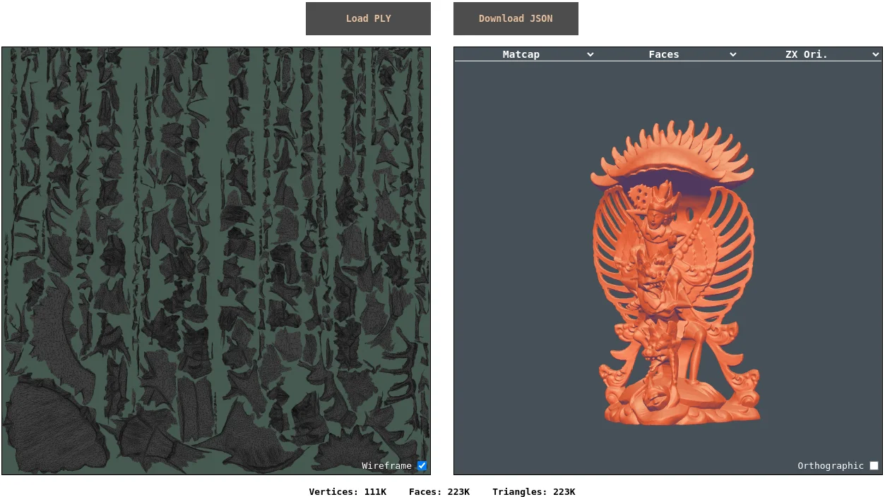
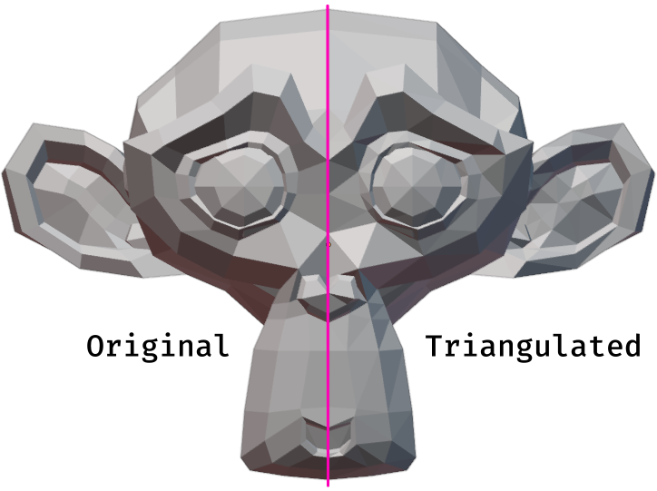
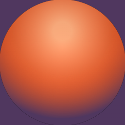

# Year of Unity - September & October: Convert PLY models to JSON

  

Continuing the trend of not-actually-making-a-game, I decided to look into understanding how 3D model data is encoded/represented for rendering. Oddly enough, this is something I've been curious about for many years now, long before experimenting with Unity, so this was actually a pretty satisfying project for me.

The entire project boils down to the single html file included in this repo (along with all the imported css/js files from the other folders!). Opening the html file in a browser should 'just work' and doesn't require any fancy server setup or installation of any other software.

## Goals
The idea was to take a text-readable model format (i.e. polygon file format, aka [PLY](https://en.wikipedia.org/wiki/PLY_(file_format))) and be able to convert the data into another format (javascript object notation, aka [JSON](https://en.wikipedia.org/wiki/JSON)) and ultimately render the model as well as it's UV map (if present). I figured that manipulating the model data into another format would require really understanding the data structuring, while rendering from that format would require understanding how the data is actually used in practice.

#### No libraries
There are lots of libraries that would have helped speed up the development of this project, particularly when it comes to rendering ([threejs](https://threejs.org/) seems like an obvious choice, for example), however I wanted to try to implement things from scratch as much as possible to make sure there was 'no magic' in how things were working. This is likely some kind of character flaw on my part.

#### Parsing binary data
It turns out that the PLY file format comes in both ascii and binary versions! While I started with only supporting the much simpler-to-understand ascii version, having a system that couldn't handle the (more common and efficient) binary format felt incomplete. Updating the code to support both versions ended up complicated the code base quite a bit, but the binary format was genuinely interesting to work through, and I feel like I learned quite about about data encoding as well as how to deal with binary data in javascript.

#### Visualizing UV data
I really like the UV editor found in [Blender](https://docs.blender.org/manual/en/latest/editors/uv/introduction.html) and originally wanted to mimic the vertex/edge/face selection capabilities. I was especially interested in adding support for mapping mouse positions in UV space to points on a 3D mesh and vice versa. This turned out to be overly ambitious, and so I scrapped most of the interactive elements. Still, adding in a basic 2D UV map visualization _was_ something I could manage, along with adding support for coloring the 3D mesh data according to UV space coordinates.

#### Smooth vs. face vs. triangle shading
This feature piqued my interest after realizing that when using flat shading, a model made of quads looks different from the same model when triangulated. This is noticable using the built-in monkey model in Blender (see the ears or sides of the jaw, for example).

  

Prior to this, I understood that 3D artists prefer using quads for ease-of-editing (they allow [loop-cuts](https://docs.blender.org/manual/en/latest/modeling/meshes/tools/loop.html) for example), even though conventional rendering only supports triangles. So I was under the impression that quad-based models would render identically to triangulated models, and renderers (e.g. Unity) would just convert to triangulated models on import or at runtime. Turns out I was wrong, though Blender's support for flat shading on quads does a great job at maintaining this illusion!

Understanding how this works and implementing support for flat-face vs. flat-triangle vs smooth shading was easily the most interesting part of this project.

#### Matcap rendering
In order to properly visualize a 3D model on a 2D screen, some kind of lighting or texturing is needed to give variations in color or brightness to the surface of the model. Without this, a 3D model would appear as a flat silhouette at best. One really interesting and high quality option for rendering is to use 'material captures' (or [matcaps](https://github.com/nidorx/matcaps/blob/master/README.md)).

  

Unlike more conventional texturing, which uses UV coordinates to sample from textures, matcaps use the normal vectors of a model, projected down to 2D relative to the camera view, as the texture sampling coordinates. If a texture with spherical lighting is used, then this can give the effect that the model is being rendered with high quality lighting, which changes as the model is rotated. Not only do these look pretty, but they made a lot of sense given that adding support for dynamic custom lighting or textures was outside the scope of this project.

The matcap for this project is actually generated dynamically at runtime, which allows for experimenting with the colors.